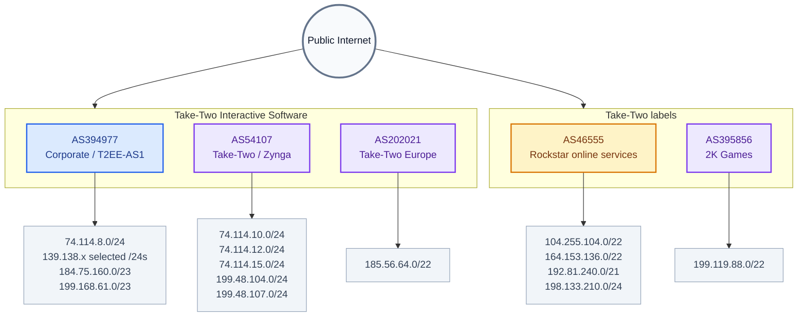

<div align="center">
  
  <h1>Take-Two Interactive Network Data</h1>

  [](REVIEW.md)
  [](https://github.com/ynwglobal/Take-Two/commits/main/)
  [](source_snapshot.json)
  [](LICENSE)
</div>

## Overview

This repository contains a research-oriented snapshot of publicly announced
IPv4 network space associated with **Take-Two Interactive Software, Inc.** and
several of its labels and subsidiaries, including Rockstar Games, 2K Games,
and Zynga.

The dataset is intended for defensive inventory, firewall review, SIEM
enrichment, and validation of existing allowlists. A BGP announcement or
registry attribution does **not** prove that an address is currently an active
game server or that a particular service is operated from that address.

> **Snapshot date:** September 19, 2026  
> **Current commit badge:** The GitHub last-commit badge above updates
> automatically after this README is committed to the upstream repository.

## Table of Contents

- [Dataset Snapshot](#dataset-snapshot)
- [Files](#files)
- [What Was Corrected](#what-was-corrected)
- [Current ASN Coverage](#current-asn-coverage)
- [Quick CIDR Reference](#quick-cidr-reference)
- [Network Visualization](#network-visualization)
- [Missing Ranges Added](#missing-ranges-added)
- [Data Quality and Cleaning](#data-quality-and-cleaning)
- [Usage](#usage)
- [Defensive Monitoring](#defensive-monitoring)
- [Known Limitations](#known-limitations)
- [Methodology and Sources](#methodology-and-sources)
- [Responsible Use](#responsible-use)
- [Author](#author)
- [Contributing](#contributing)
- [License](#license)
- [Disclaimer](#disclaimer)

## Dataset Snapshot

| Dataset | Unique IPv4 addresses | Notes |
| :--- | ---: | :--- |
| `take-two_ips.csv` | **19,594** | Corrected, deduplicated master list |
| `Rockstar_ips.csv` | **4,344** | Upstream Rockstar list after deduplication |
| Added to master | **3,822** | Addresses from nine currently announced ranges |

The corrected master file contains one IPv4 address per line. Its first line
is a summary and is not a CSV header:

```text
Total unique IPs: 19594
```

## Files

| File | Purpose |
| :--- | :--- |
| `take-two_ips.csv` | Corrected master IP list for direct use in place of the upstream file |
| `Rockstar_ips.csv` | Rockstar-focused upstream list; raw rows contain duplicates from overlapping CIDRs |
| `missing_cidrs.txt` | Compact list of the nine ranges added to the master list |
| `current_routes_by_asn.txt` | Complete IPv4 route snapshot for the five reviewed ASNs, including more-specific announcements |
| `source_snapshot.json` | Machine-readable copy of the route comparison |
| `REVIEW.md` | Findings, counts, and correction notes |
| `original/` | Original downloaded repository files retained for comparison |

## What Was Corrected

The corrected files address the following issues in the original snapshot:

1. Added **3,822 unique IPv4 addresses** from nine currently announced
   Take-Two-associated ranges.
2. Added `139.138.242.0/24`, which was announced by AS394977 but absent from
   the original master list.
3. Added `198.133.210.0/24` to the master list. It was already present in the
   original Rockstar file.
4. Corrected the master count from **15,772** to **19,594** unique addresses.
5. Corrected the Rockstar count: the original file has **6,429 physical rows**
   but only **4,344 unique IPv4 addresses** because parent and child CIDR
   sections overlap.
6. Removed the unsupported attribution of several Take-Two ranges to AS11246.
7. Replaced the broad `139.138.224.0/19` claim with the currently announced
   AS394977 routes instead of filling unannounced gaps.

## Current ASN Coverage

The route comparison covers these five ASNs:

| ASN | Organization / label | Current address scope |
| :--- | :--- | :--- |
| `AS394977` | Take-Two corporate / T2EE-AS1 | Corporate, web, API, and public infrastructure |
| `AS46555` | Take-Two / Rockstar online services | Rockstar service blocks |
| `AS54107` | Take-Two / Zynga | Zynga and related Take-Two infrastructure |
| `AS202021` | Take-Two Europe / RSOE-EU | European service block |
| `AS395856` | 2K Games | 2K Games service block |

The complete route list, including more-specific announcements, is in
`current_routes_by_asn.txt`. The following entries summarize the primary
service blocks:

```text
AS394977  74.114.8.0/24
AS394977  139.138.224.0/24 through 139.138.255.0/24 (selected announced /24s only)
AS394977  184.75.160.0/23
AS394977  199.48.105.0/23
AS394977  199.168.61.0/23
AS394977  199.229.224.0/24
AS394977  209.204.240.0/24 through 209.204.254.0/24

AS46555   104.255.104.0/22
AS46555   164.153.136.0/22
AS46555   192.81.240.0/21
AS46555   198.133.210.0/24

AS54107   74.114.10.0/24
AS54107   74.114.12.0/24
AS54107   74.114.15.0/24
AS54107   199.48.104.0/24
AS54107   199.48.107.0/24

AS202021  185.56.64.0/22
AS395856  199.119.88.0/22
```

The `139.138.224.0/19` line above is intentionally described as selected
`/24`s. It is not a claim that every `/24` inside the `/19` is announced.

## Quick CIDR Reference

### Rockstar / Take-Two online services

These are the primary aggregate blocks associated with AS46555:

```text
104.255.104.0/22
164.153.136.0/22
192.81.240.0/21
198.133.210.0/24
```

### Additional Take-Two and label ranges

```text
74.114.8.0/24
74.114.10.0/24
74.114.12.0/24
74.114.15.0/24
185.56.64.0/22
199.48.104.0/24
199.48.105.0/23
199.48.107.0/24
199.119.88.0/22
```

The complete, non-abbreviated route snapshot is maintained in
`current_routes_by_asn.txt`. Use that file when a workflow requires every
more-specific announcement rather than an aggregate reference.

## Network Visualization

The diagram shows the reviewed ownership relationships without implying that
every address is an active endpoint:



## Missing Ranges Added

These ranges were absent from the upstream `take-two_ips.csv` and were added
to the corrected master list:

| CIDR | ASN | Attribution | Host addresses added |
| :--- | :---: | :--- | ---: |
| `74.114.10.0/24` | `AS54107` | Take-Two / Zynga | 254 |
| `74.114.12.0/24` | `AS54107` | Take-Two / Zynga | 254 |
| `74.114.15.0/24` | `AS54107` | Take-Two / Zynga | 254 |
| `139.138.242.0/24` | `AS394977` | Take-Two corporate | 254 |
| `185.56.64.0/22` | `AS202021` | Take-Two Europe | 1,022 |
| `198.133.210.0/24` | `AS46555` | Rockstar / Take-Two | 254 |
| `199.48.104.0/24` | `AS54107` | Take-Two / Zynga | 254 |
| `199.48.107.0/24` | `AS54107` | Take-Two / Zynga | 254 |
| `199.119.88.0/22` | `AS395856` | 2K Games | 1,022 |

## Data Quality and Cleaning

### `take-two_ips.csv`

The first line is a summary, not a header. To create a clean IP-only file:

<details>
<summary><strong>Bash / Linux / macOS</strong></summary>

```bash
tail -n +2 take-two_ips.csv \
  | awk '/^[0-9]{1,3}(\.[0-9]{1,3}){3}$/' \
  | sort -V -u \
  > take-two_ips_cleaned.txt
```

</details>

<details>
<summary><strong>PowerShell</strong></summary>

```powershell
(Get-Content take-two_ips.csv | Select-Object -Skip 1 |
  Where-Object { $_ -match '^\d{1,3}(\.\d{1,3}){3}$' } |
  Sort-Object -Unique) |
  Set-Content take-two_ips_cleaned.txt
```

</details>

### `Rockstar_ips.csv`

The upstream Rockstar file includes explanatory sections, parent CIDRs, child
CIDRs, and a numbered IP list. Parent and child sections overlap, so the raw
row count must not be treated as a unique-IP count:

```bash
awk -F, '/^[0-9]+,([0-9]{1,3}\.){3}[0-9]{1,3}$/ { print $2 }' \
  Rockstar_ips.csv \
  | sort -V -u \
  > rockstar_ips_cleaned.txt
```

The cleaned Rockstar list contains **4,344 unique IPv4 addresses**.

## Usage

### Firewall and SIEM enrichment

Use `take-two_ips_cleaned.txt` or the canonical CIDR list as an input to
systems you own or administer. Prefer the smallest required range instead of
allowlisting an entire aggregate when the service does not need it.

### Python

```python
from ipaddress import ip_address

with open("take-two_ips.csv", encoding="utf-8") as source:
    addresses = {
        ip_address(line.strip())
        for line in source
        if line.strip() and line.strip()[0].isdigit()
    }

print(f"Loaded {len(addresses):,} unique IPv4 addresses")
```

### Route inventory

For CIDR-based workflows, use `missing_cidrs.txt` for the corrected additions
and `current_routes_by_asn.txt` for the complete route snapshot. Routing data
can change, so refresh the sources before deploying a production firewall or
allowlist change.

## Defensive Monitoring

For authorized defensive workflows, these public-data queries can help
validate attribution without treating search results as proof of ownership:

| Source | Query |
| :--- | :--- |
| Shodan | `org:"Take-Two Interactive"` |
| Shodan | `asn:AS46555` |
| Shodan | `hostname:rockstargames.com` |
| Censys | `autonomous_system.asn: 46555` |

Use passive sources, rate limits, and explicit authorization for any
validation activity. Do not perform broad scans against live game services or
third-party infrastructure.

## Known Limitations

- This is a dated routing snapshot, not a continuously synchronized inventory.
- BGP ownership and ASN attribution do not identify the service running on an IP.
- Cloud, CDN, anti-DDoS, and shared-hosting addresses may serve more than one
  organization or product.
- The master file is IPv4-only; it does not represent Take-Two IPv6 space.
- The presence of an address in this dataset does not establish that it is
  reachable, active, or approved for interaction.

## Methodology and Sources

This snapshot was checked on **September 19, 2026** using:

- ASN-level announced-prefix data from RIPEstat
- BGP route and ASN data from BGP.tools and Hurricane Electric
- Registry and organization attribution from public routing databases
- Deduplication and CIDR comparison against the upstream CSV files

### Source links

- [RIPEstat AS394977 announced prefixes](https://stat.ripe.net/data/announced-prefixes/data.json?resource=AS394977)
- [RIPEstat AS46555 announced prefixes](https://stat.ripe.net/data/announced-prefixes/data.json?resource=AS46555)
- [RIPEstat AS54107 announced prefixes](https://stat.ripe.net/data/announced-prefixes/data.json?resource=AS54107)
- [RIPEstat AS202021 announced prefixes](https://stat.ripe.net/data/announced-prefixes/data.json?resource=AS202021)
- [RIPEstat AS395856 announced prefixes](https://stat.ripe.net/data/announced-prefixes/data.json?resource=AS395856)
- [AS394977 on BGP.tools](https://bgp.tools/as/394977)
- [AS46555 on BGP.tools](https://bgp.tools/as/46555)
- [AS54107 on BGP.tools](https://bgp.tools/as/54107)
- [AS202021 on Hurricane Electric](https://bgp.he.net/AS202021)
- [AS395856 on IPIP.NET](https://whois.ipip.net/AS395856)

## Responsible Use

Use this data only for systems and networks you own or are explicitly
authorized to administer. Do not scan, probe, or interact with these addresses
without permission. Follow applicable laws, provider terms, and responsible
disclosure procedures.

If you identify a security issue in an in-scope Rockstar asset, use the
[Rockstar Games HackerOne program](https://hackerone.com/rockstargames) and
avoid actions that could affect live services or players.

## Author

Maintained by [ynwglobal](https://github.com/ynwglobal) as a public network
data reference.

## Contributing

Contributions are welcome. When proposing a new range, include:

1. The CIDR and ASN.
2. The source and the date it was observed.
3. Whether the range is currently announced.
4. A clear explanation of why it should be attributed to Take-Two or one of
   its labels.

Do not add unannounced holes inside a larger allocation without independent,
current evidence.

## License

This project is licensed under the MIT License. See [LICENSE](LICENSE) for
details.

## Disclaimer

This repository and its data are provided for educational, defensive, and
research purposes. The presence of an IP address or CIDR does not guarantee
current ownership, activity, service identity, or authorization to interact
with the system.

The maintainers are not responsible for actions taken with this information.
Users are responsible for complying with applicable laws, contracts, provider
terms, and authorization requirements.

---

**Maintained as a dated network-data snapshot.** Verify current routing and
ownership before using this information in production.
