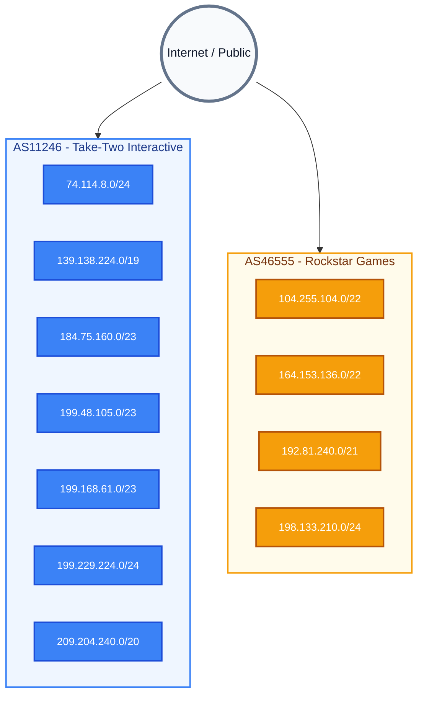
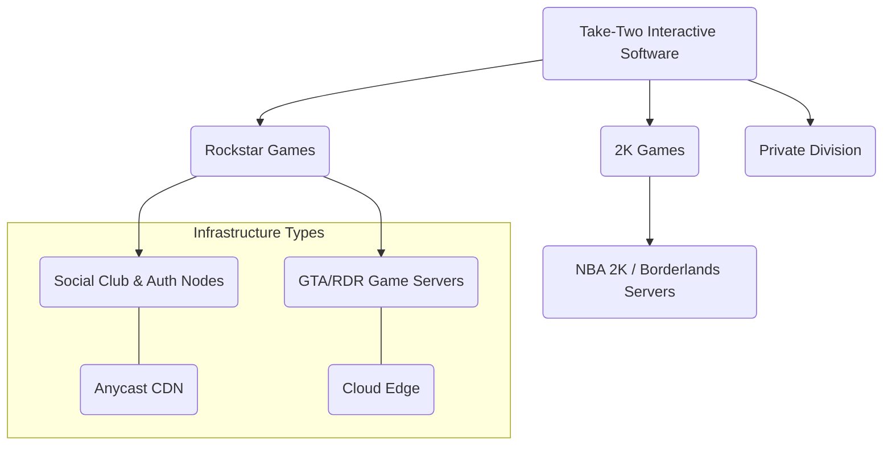

<div align="center">
  
  <h1>Take-Two Interactive Network Infrastructure Analysis</h1>

  [](http://hbkvxncent.globalstats.xyz/)
  [](http://hbkvxncent.globalstats.xyz/)
  [](https://discord.globalstats.xyz)
  [](https://opensource.org/licenses/MIT)
  [](#)
</div>

## Overview

This repository hosts a comprehensive dataset focused on the network infrastructure of **Take-Two Interactive Software, Inc.** and its subsidiaries (Rockstar Games, 2K, Private Division, etc.). The project aims to map public-facing assets, game servers, and corporate nodes for security research and network analysis purposes.

## Table of Contents

- Overview
- Dataset Contents
- Data Quality and Cleaning
- Identified Network Ranges
- Recommended Tools
- Usage
- Known Limitations
- Contributing
- License
- Disclaimer

## Dataset Contents

The files in this repository contain lists of IP addresses associated with Take-Two Interactive and its subsidiaries. The `take-two_ips.csv` file contains 15,772 unique IP addresses. The `Rockstar_ips.csv` file contains 6,382 individual IP addresses.

### Files

#### `take-two_ips.csv`

**Type:** Master Dataset
**Format:** Line-separated IPs
**Rows:** 15,773
**Columns:** N/A (Raw IPs)

**Description:**
This file represents the complete, unfiltered network footprint of Take-Two Interactive Software, Inc. It is generated through ASN enumeration and passive reconnaissance. It includes infrastructure for all subsidiary labels and studios. **Note:** This file is not a standard CSV. The first line is a summary (`Total unique IPs: 15772`) and is not a header.

**Contents:**
*   **Corporate:** Parent company infrastructure, internal tools, VPN gateways, and email servers.
*   **Publishing Labels:** Infrastructure for 2K Games, Private Division, and Ghost Story Games.
*   **Development Studios:** Nodes associated with Firaxis, Hangar 13, Visual Concepts, and Cat Daddy Games.
*   **Cloud Infrastructure:** Assets hosted on AWS, Google Cloud, and Azure utilized by backend services.
*   **Content Delivery:** Nodes associated with CDN endpoints for game patches and media distribution.

**Technical Application:**
*   **SIEM Integration:** Ingesting into Splunk, Elastic Stack, or other monitoring tools to tag traffic associated with Take-Two.
*   **Firewall Rules:** Generating whitelist/blacklist objects for enterprise network policies.
*   **Asset Discovery:** A baseline for security researchers performing reconnaissance on public-facing infrastructure.

#### `Rockstar_ips.csv`


**Type:** Targeted Subset
**Format:** CSV
**Columns:** `index`, `ip`

**Description:**
A curated subset of the master dataset, strictly filtering for assets allocated to **Rockstar Games** (AS46555). This list excludes general Take-Two infrastructure to focus on the specific needs of Rockstar titles. The file contains an extensive 39-line header with CIDR block information, followed by a numbered list of IP addresses. The data is formatted as `index,ip` but does not contain a formal CSV header row.

**Contents:**
*   **Game Servers:** Dedicated session hosts for *Grand Theft Auto V* (GTA Online) and *Red Dead Redemption 2* (Red Dead Online).
*   **Authentication:** Social Club login servers, cloud save synchronization endpoints, and launcher update nodes.
*   **Matchmaking:** Telemetry and matchmaking coordinators.
*   **Analytics:** Endpoints used for collecting game performance data and crash reporting.

**Technical Application:**
*   **Network Optimization:** Prioritizing traffic (QoS) for Rockstar titles on gaming routers.
*   **Latency Testing:** Pinging specific clusters to determine the nearest or most stable data center.
*   **Troubleshooting:** Isolating connectivity issues by verifying reachability to specific game subnets.
*   **Geofencing:** Identifying regional server clusters to optimize connection paths.

## Data Quality and Cleaning

The data files in this repository are generated from automated scripts and may include formatting quirks. Before integrating the IP lists into other tools, it is recommended to clean them.

### `take-two_ips.csv`

This file contains a summary line at the beginning and may have blank lines at the end. The following snippets will create a cleaned file named `take-two_ips_cleaned.txt`.

<details>
<summary><strong>PowerShell (Windows)</strong></summary>

```powershell
(Get-Content take-two_ips.csv | Select-Object -Skip 1 | Where-Object { $_ -match '^\d{1,3}\.\d{1,3}\.\d{1,3}\.\d{1,3}$' }) | Set-Content take-two_ips_cleaned.txt
```
</details>

<details>
<summary><strong>Bash (Linux/macOS)</strong></summary>

```bash
grep -E "^[0-9]{1,3}(\.[0-9]{1,3}){3}$" take-two_ips.csv > take-two_ips_cleaned.txt
```
</details>

*Use `take-two_ips_cleaned.txt` in the integration snippets below.*

### `Rockstar_ips.csv`

This file includes a descriptive header and footer. While the Python script in the Usage Example section handles this programmatically, you can also clean it using command-line tools to generate a flat IP list.

<details>
<summary><strong>Bash (Linux/macOS)</strong></summary>

```bash
# Extract only the IP column (field 2) from lines starting with a number
grep -E "^[0-9]+," Rockstar_ips.csv | cut -d, -f2 > rockstar_ips_cleaned.txt
```
</details>

### Identified Network Ranges

Analysis of the scan data indicates the following subnets are actively utilized by Take-Two Interactive. An **ASN** column has been added to identify the responsible autonomous system.

| Subnet Range | ASN | Description |
| :--- | :--- | :--- |
| **74.114.8.0/24** | AS11246 | Corporate / Legacy Infrastructure |
| **104.255.104.0 - 104.255.107.255** | AS46555 | Game Services |
| **139.138.224.0 - 139.138.255.255** | AS11246 | Primary Datacenter Block |
| **164.153.136.0 - 164.153.139.255** | AS46555 | Online Services |
| **184.75.160.0 - 184.75.161.255** | AS11246 | Web & API Endpoints |
| **192.81.240.0 - 192.81.247.255** | AS46555 | Cloud Infrastructure |
| **198.133.210.0/24** | AS46555 | Rockstar Games Dedicated Services |
| **199.48.105.0 - 199.48.106.255** | AS11246 | Legacy Game Servers |
| **199.168.61.0 - 199.168.62.255** | AS11246 | Internal Services |
| **199.229.224.0/24** | AS11246 | Network Operations |
| **209.204.240.0 - 209.204.254.255** | AS11246 | Public Facing Assets |

### Quick CIDR Reference (Rockstar Games)

For firewall whitelisting or targeted scanning, here are the primary CIDR blocks extracted from `Rockstar_ips.csv`:

```text
104.255.104.0/22
164.153.136.0/22
192.81.240.0/21
198.133.210.0/24
```

### Network Visualization

> **Note:** GitHub's mobile app and some mobile browsers may not render Mermaid diagrams, displaying raw code instead. Please view this section on a desktop browser for the full visual experience.



## Threat Intelligence & Monitoring

To pivot from IP lists to active threat intelligence, consider using the following search queries on public scanning engines.

### Shodan Dorks
*   **Organization:** `org:"Take-Two Interactive"`
*   **ASN:** `asn:AS46555`
*   **Hostname:** `hostname:rockstargames.com`
*   **Specific Range:** `net:104.255.104.0/22`

### Censys Queries
*   **ASN:** `autonomous_system.asn: 46555`
*   **Certificate Subject:** `services.tls.certificates.leaf_data.subject.common_name: *.rockstargames.com`

## Recommended Tools

The following tools are recommended for utilizing this dataset effectively:

*   **Nmap:** For active service discovery and version detection on the identified IPs.
*   **Masscan:** For high-speed scanning of the large subnets to verify host liveness.
*   **Wireshark:** For analyzing packet captures when troubleshooting connectivity to these IPs.

## Usage Example

You can easily integrate this data into your analysis workflows. Here is a quick example using Python to load the Rockstar Games IP addresses:

```python
import pandas as pd

# Load the Rockstar Games dataset, skipping the header lines
# The file has a non-standard 39-line header, so we skip it.
# We also handle the footer by coercing the index to numeric and dropping invalid rows.
df = pd.read_csv('Rockstar_ips.csv', skiprows=39, names=['index', 'ip'], on_bad_lines='skip')

# Filter out any footer lines or malformed data
df = df[pd.to_numeric(df['index'], errors='coerce').notnull()]

# The 'ip' column contains the IP addresses.
print(f"Loaded {len(df)} IPs from Rockstar_ips.csv")
print(df.head())

# Example: Get the list of IPs
rockstar_ips = df['ip'].tolist()
print("\nFirst 5 IPs:")
print(rockstar_ips[:5])
```

## Known Limitations
* The datasets are based on publicly available information and may not be fully comprehensive.
* IP ranges can change over time. This data represents a snapshot and may become outdated.
* The presence of an IP in this list does not guarantee it is currently active or in use by Take-Two Interactive.

### Visual Infrastructure Map

> **Note:** GitHub's mobile app and some mobile browsers may not render Mermaid diagrams, displaying raw code instead. Please view this section on a desktop browser for the full visual experience.


### Methodology
This dataset was compiled using a multi-stage reconnaissance approach:

- ASN Enumeration: Identification of primary Autonomous System Numbers (e.g., AS11246) associated with Take-Two and subsidiaries.

- Reverse DNS (rDNS): Mass-scanning of identified ranges to verify hostname patterns (e.g., *.rockstargames.com).

- TLS/SSL Inspection: Analysis of Certificate Transparency (CT) logs to identify infrastructure used for "Social Club" and "Authentication Services."

- Peering DB Analysis: Verifying physical datacenter locations and exchange point presence.

### Advanced Integration Snippets
Help users bridge the gap between your CSV and their existing tools. See the **Data Quality and Cleaning** section first.

#### A. Nmap Integration
To verify which services are currently active on these IPs (using a cleaned file):

```bash
# Scan for common game service ports (80, 443, 6672, 61455-61458)
nmap -sV -Pn -p 80,443,6672,61455-61458 -iL take-two_ips_cleaned.txt -oG scan_results.gnmap
```

#### B. Masscan (For Speed)
For high-speed discovery across the entire block (using a cleaned file):

```bash
masscan -p443 --rate 1000 -iL take-two_ips_cleaned.txt --exclude 255.255.255.255
```
### Responsible Disclosure
If you use this data to identify vulnerabilities (such as open S3 buckets or exposed dev environments), please follow ethical guidelines:

- **Rockstar Games Bug Bounty**: Rockstar Games, a subsidiary of Take-Two, operates an official bug bounty program. Please report vulnerabilities for in-scope assets via their [HackerOne page](https://hackerone.com/rockstargames).

- **Rate Limiting**: Ensure your scanning tools do not impact the availability of live game services for players.

## Author

**Made by [hbkvxncent](https://hbkvxncent.globalstats.xyz/)**

## Contributing

Contributions are welcome! If you have suggestions for improving the dataset, please open an issue or submit a pull request.

## License

This project is licensed under the MIT License - see the [LICENSE](LICENSE) file for details.

---

## Disclaimer & Legal Warning

> [!WARNING]
> This repository and the data contained within are provided for **educational and research purposes only**. Network scanning, probing, or interacting with systems you do not own or have explicit permission to test may violate laws such as the **Computer Fraud and Abuse Act (CFAA)** in the United States or similar regulations in other jurisdictions.
>
> **Liability Waiver:** The author ([hbkvxncent](https://hbkvxncent.globalstats.xyz/)) is **in no way responsible** for any actions, damages, or legal consequences resulting from the use, misuse, or interpretation of the data provided in this repository. By accessing this data, you agree that you are solely responsible for your actions and compliance with all applicable laws and terms of service.

